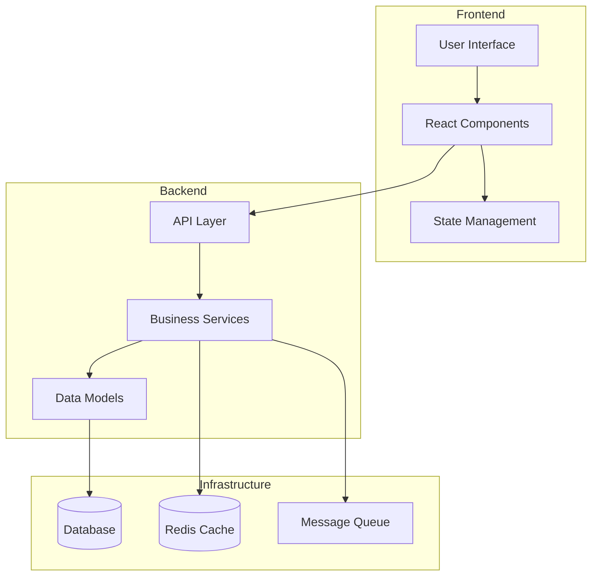
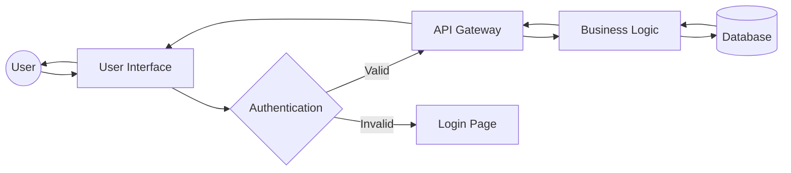
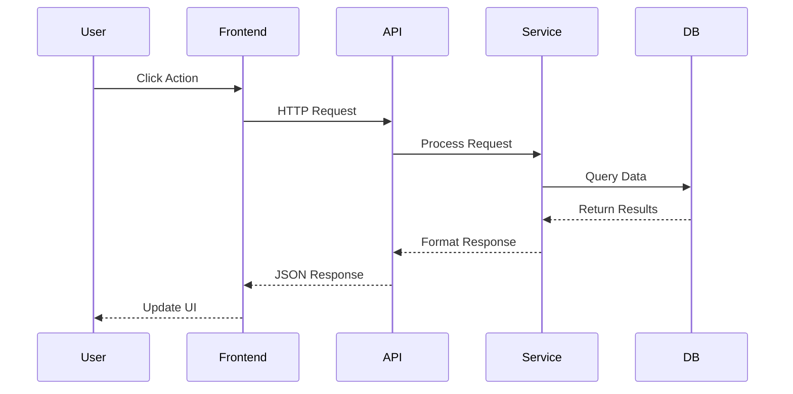
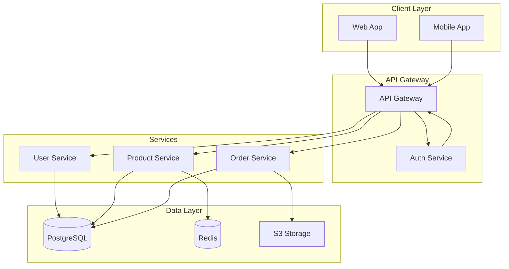
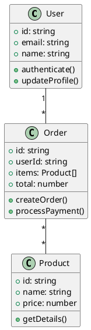
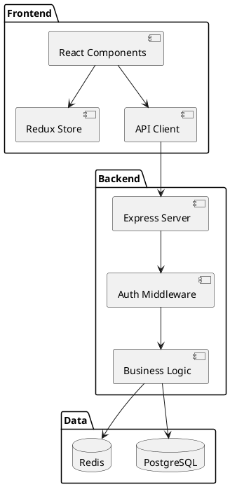
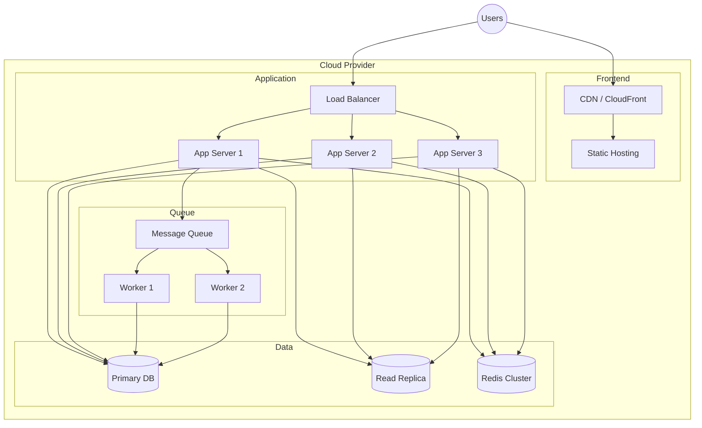

# Architecture Diagram Generator

I'll analyze your codebase and generate visual architecture diagrams showing component relationships, data flow, and system structure.

Arguments: `$ARGUMENTS` - diagram type or format (e.g., "mermaid", "plantuml", "component", "data-flow")

## Strategic Analysis Process

<think>
Effective architecture diagrams require understanding:

1. **Project Structure Analysis**
   - What's the application architecture? (monolith, microservices, serverless)
   - What layers exist? (frontend, backend, database, services)
   - How do components communicate?
   - What are the major modules and their responsibilities?
   - Are there clear architectural patterns? (MVC, MVVM, Clean Architecture)

2. **Diagram Type Selection**
   - Component diagram: Show major components and relationships
   - Sequence diagram: Show interaction flows
   - Data flow diagram: Show how data moves through system
   - Deployment diagram: Show infrastructure and deployment
   - Class diagram: Show object-oriented structure
   - Entity-relationship: Show database schema

3. **Format Decision**
   - Mermaid: Simple, version-controllable, GitHub/GitLab rendering
   - PlantUML: More features, complex diagrams, requires rendering
   - Diagrams.net (Draw.io): Visual editing, XML format
   - ASCII art: Terminal-friendly, simple visualizations

4. **Detail Level**
   - High-level overview: Major components only
   - Medium detail: Components + key interactions
   - Detailed: All modules, functions, data flows
   - Focus on what's most valuable for documentation
</think>

## Phase 1: Architecture Discovery

**MANDATORY FIRST STEPS:**
1. Analyze project structure and file organization
2. Identify architectural patterns from code
3. Map component dependencies
4. Detect technology stack and frameworks

Let me analyze your project architecture:

```bash
# Analyze project structure
echo "=== Architecture Analysis ==="

# Detect project type
if [ -d "src/components" ] || [ -d "components" ]; then
    echo "Frontend components detected"
fi

if [ -d "src/api" ] || [ -d "api" ] || [ -d "routes" ]; then
    echo "API/Backend layer detected"
fi

if [ -d "src/models" ] || [ -d "models" ]; then
    echo "Data models detected"
fi

if [ -d "src/services" ] || [ -d "services" ]; then
    echo "Service layer detected"
fi

# Count major components
echo ""
echo "Component counts:"
find src -type f -name "*.js" -o -name "*.ts" -o -name "*.jsx" -o -name "*.tsx" 2>/dev/null | wc -l | xargs echo "Files:"
find src -type d -maxdepth 2 2>/dev/null | wc -l | xargs echo "Directories:"

# Identify framework
if grep -q "\"next\"" package.json 2>/dev/null; then
    echo "Framework: Next.js"
elif grep -q "\"react\"" package.json 2>/dev/null; then
    echo "Framework: React"
elif grep -q "\"vue\"" package.json 2>/dev/null; then
    echo "Framework: Vue"
elif grep -q "\"express\"" package.json 2>/dev/null; then
    echo "Framework: Express (Node.js)"
fi
```

## Phase 2: Component Relationship Mapping

I'll map relationships between components:

**Analysis Methods:**
- Import/export analysis (module dependencies)
- API endpoint mapping (request/response flows)
- Database relationship detection (foreign keys, relations)
- Event system mapping (event emitters/listeners)
- Service dependencies (dependency injection patterns)

**Using Native Tools:**
- **Grep** to find import statements and dependencies
- **Glob** to identify component files by pattern
- **Read** key architectural files (routers, services, models)
- Pattern detection for architectural styles

I'll analyze:
- Frontend component hierarchy
- Backend route handlers and middleware
- Service layer dependencies
- Database entity relationships
- External API integrations

## Phase 3: Diagram Generation

Based on analysis, I'll generate appropriate diagrams:

### Mermaid Diagrams (Default)

**Component Diagram:**


**Data Flow Diagram:**


**Sequence Diagram:**


**System Architecture:**


### PlantUML Diagrams

**Class Diagram:**


**Component Diagram:**


### Deployment Diagram

**Infrastructure Visualization:**


## Phase 4: Diagram Output

I'll create diagram files in your project:

**File Creation:**
- `docs/architecture/components.mmd` - Component diagram
- `docs/architecture/data-flow.mmd` - Data flow diagram
- `docs/architecture/deployment.mmd` - Deployment diagram
- `docs/architecture/sequence.mmd` - Sequence diagrams
- `docs/architecture/README.md` - Documentation with rendered diagrams

**Markdown Integration:**
```markdown
# System Architecture

## Component Diagram

```mermaid
[diagram content]
```

## Data Flow

```mermaid
[diagram content]
```

This automatically renders on GitHub, GitLab, and many documentation platforms.
```

## Token Optimization Strategy

**Efficient Analysis:**
- Use Glob to find architectural files quickly
- Grep for import patterns instead of reading all files
- Focus on high-level architecture (avoid over-detailing)
- Generate one diagram type at a time
- Use compact diagram syntax

**Targeted Generation:**
- Ask user for specific diagram type first
- Skip irrelevant architectural layers
- Generate overview before details
- Provide diagram templates for user customization

## Integration Points

**Synergistic Skills:**
- `/understand` - Deep project architecture analysis
- `/docs` - Documentation generation and management
- `/api-docs-generate` - API-specific documentation
- `/db-diagram` - Database schema visualization

Suggests `/understand` when:
- Need deeper code analysis first
- Architecture is unclear from structure
- Complex dependencies need mapping

Suggests `/db-diagram` when:
- Database schema is complex
- Need detailed ER diagrams
- Focus is on data modeling

## Diagram Format Options

**Mermaid (Recommended):**
- ✓ GitHub/GitLab native rendering
- ✓ Version control friendly (text)
- ✓ Easy to edit and update
- ✓ Live preview in many editors
- ✗ Limited advanced features

**PlantUML:**
- ✓ More diagram types
- ✓ Advanced styling options
- ✓ Large community support
- ✗ Requires separate rendering
- ✗ More complex syntax

**Diagrams.net (Draw.io):**
- ✓ Visual WYSIWYG editing
- ✓ Professional appearance
- ✓ Export to multiple formats
- ✗ XML format harder to diff
- ✗ Not natively rendered in GitHub

**ASCII Art:**
- ✓ Terminal-friendly
- ✓ No dependencies
- ✓ Simple and fast
- ✗ Limited visual appeal
- ✗ Hard to maintain complex diagrams

## Diagram Types Generated

**Component Diagram:**
- Shows major system components
- Component relationships and dependencies
- Layer separation (frontend, backend, data)
- External integrations

**Data Flow Diagram:**
- How data moves through the system
- User interactions and workflows
- API request/response flows
- Data transformations

**Sequence Diagram:**
- Step-by-step interaction flows
- API call sequences
- Authentication flows
- Complex business processes

**Deployment Diagram:**
- Infrastructure components
- Server architecture
- Cloud resources
- Scaling strategy

**Database Diagram:**
- Entity relationships
- Table structures
- Foreign key relationships
- Database architecture

## Auto-Detection Features

I'll automatically detect and diagram:

**Frontend Architecture:**
- React/Vue/Angular component hierarchy
- State management flows (Redux, Vuex, etc.)
- Routing structure
- API client integration

**Backend Architecture:**
- REST API endpoints and routes
- Middleware chain
- Service layer organization
- Database access patterns

**Microservices:**
- Service boundaries
- Inter-service communication
- Message queues
- Service mesh patterns

**Database:**
- Table relationships
- Entity models
- Caching layers
- Data access patterns

## Safety Mechanisms

**Protection Measures:**
- Preview diagrams before file creation
- Create diagrams in `docs/architecture/` directory
- Non-destructive (only creates new files)
- Easy to regenerate or update

**Validation Steps:**
1. Verify diagram syntax is valid
2. Check diagrams render correctly
3. Ensure accuracy against codebase
4. Validate all components included

## Expected Outputs

**Documentation Files:**
- Architecture overview diagram
- Component relationship diagram
- Data flow visualization
- Deployment architecture
- README with embedded diagrams

**Diagram Formats:**
- Mermaid (`.mmd` files)
- PlantUML (`.puml` files)
- Markdown with embedded diagrams
- Separate diagram documentation

## Common Use Cases

**New Developer Onboarding:**
- Generate complete system overview
- Show how components interact
- Explain data flows visually
- Document deployment architecture

**Technical Documentation:**
- Architecture decision records
- System design documents
- API documentation
- Infrastructure documentation

**Code Review:**
- Visualize changes impact
- Show before/after architecture
- Explain complex refactoring
- Document new features

**System Planning:**
- Design new features
- Plan refactoring efforts
- Analyze scalability
- Document technical debt

## Error Handling

If diagram generation encounters issues:
- I'll explain what architectural information is missing
- Suggest additional code exploration needed
- Provide partial diagrams with notes
- Offer alternative diagram approaches

## Important Notes

**I will NEVER:**
- Add AI attribution to diagram files
- Overwrite existing architecture diagrams without confirmation
- Generate diagrams without analyzing actual code
- Include sensitive information (API keys, credentials)

**Best Practices:**
- Keep diagrams up-to-date with code changes
- Use version control for diagram files
- Document diagram conventions
- Link diagrams from main README
- Review diagrams for accuracy

## Credits

**Inspired by:**
- [Mermaid.js Documentation](https://mermaid-js.github.io/)
- [PlantUML Documentation](https://plantuml.com/)
- [C4 Model](https://c4model.com/) - Software architecture visualization
- [Arc42](https://arc42.org/) - Architecture documentation template
- Software architecture documentation best practices

This skill helps you create clear, maintainable architecture documentation that stays synchronized with your codebase.
